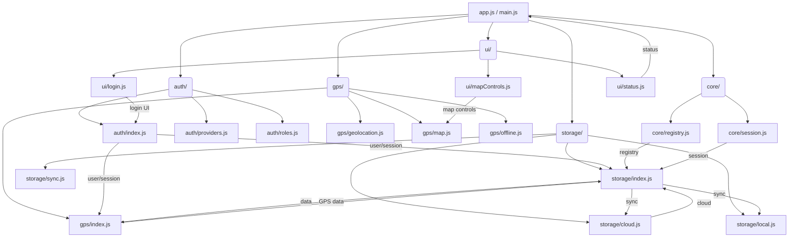

# Recommended Modular App Structure

Below is a Mermaid diagram representing the suggested modular structure for the Archaeolab app, supporting user login, cloud storage, and robust GPS features.

**How to use:**
- Paste this code into any Mermaid-compatible Markdown editor or the [Mermaid Live Editor](https://mermaid.live/).
- Export as SVG, PNG, or PDF as needed.
- Use this as a reference for future refactoring and feature planning.
